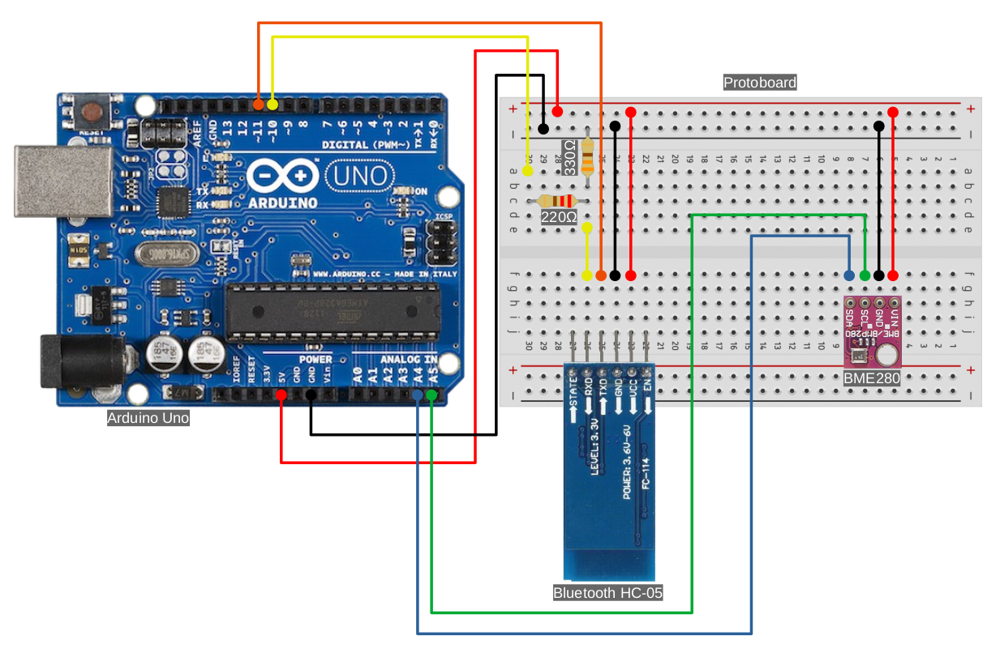

<h1><center>univesp-integrador-2023-sem1</center></h1>

# Resumo

O projeto consiste em 3 etapas:

 1. Coleta de dados meteorológicos
 2. Treinamento do modelo (machine learning)
 3. Predição do clima utilizando o modelo

# 1. Coleta de dados meteorológicos

Para coleta dos dados foi utilizado o arduino com os componentes BME280 e Bluetooth HC-05.

O script utilizado no arduino está localizado em **src/ARDUINO_BLUETOOTH_BME280.2023-03-28.ino** e foi gerado utilizando conforme o esquema da **Figura 1**.


<center>**Figura 1:** Esquema arduino para coleta de dados meteorológicos.</center>

Após a coleta de dados, é gerado o **datatable** utilizando o código abaixo:


```sh
$ bash src/generate_datatable.sh
```

O datatable seguirá o seguinte formato:

|date      |time|temperature_celsius|humidity_perc|altitude_m|pressure_hPa|weather|
|----------|----|-------------------|-------------|----------|------------|-------|
|2023-03-29|09:35:26.903|24.43|67.67|827.66|917.71|sunny|
|2023-03-29|15:51:31.657|25.70|74.29|851.27|915.10|cloudy|
|2023-03-29|18:40:53.273|25.73|72.15|847.23|915.54|night|
|2023-03-29|19:47:36.449|25.46|72.83|835.71|916.82|rainy|

Para gerar o relatório dos dados (**Figura 2**) gerados obtidos foi utilizado o seguinte script:

```sh
$ Rscript src/report_data.R
```


